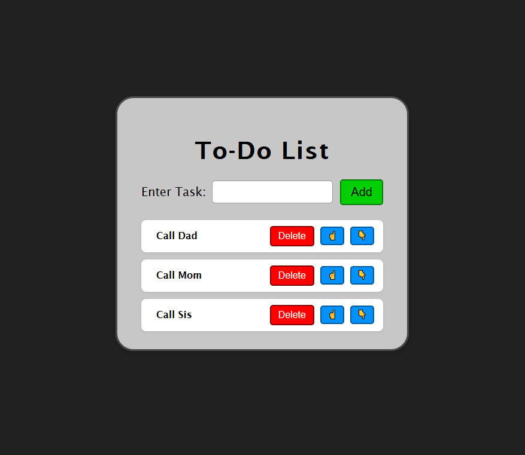

# 📝 React + Flask To-Do App with MySQL

This is a simple full-stack **To-Do List** application built with:

- **Frontend**: React.js
- **Backend**: Python Flask
- **Database**: MySQL

It supports:
- Adding tasks
- Deleting tasks
- Reordering tasks (Move Up / Down)
- Syncing all changes with MySQL
- Persisting tasks after reload

---

## 🗂️ Project Structure

```
project-root/
├── Server/
│ └── app.py    # Flask backend
│ └── todos.sql # MySQL Import File
├── Frontend/
│ └── src/
│ └── Todo.jsx  # React frontend logic
├── README.md
├── LICENSE
```

## 🔧 Prerequisites

- Node.js + npm
- Python 3
- MySQL server running locally

---

## 🛠️ MySQL Setup

In the `Server` directory, there is a file, `todos.sql`. Create a new "Database" named `todo_db`, and import the `todos.sql` to it.

---

## 🚀 Backend (Flask)
### Setup
```
cd Server
pip install flask flask-mysqldb flask-cors
```

### Environment Variables
Set the following in your terminal or .env (for local testing):
```
export sql_username=your_mysql_user
export sql_password=your_mysql_password
```

### Run Flask App
```
python app.py
```
Flask will run on http://localhost:5000

### API Endpoints
| Method | Endpoint  | Description                   |
| ------ | --------- | ----------------------------- |
| POST   | `/add`    | Add a task                    |
| POST   | `/delete` | Delete a task by index        |
| POST   | `/move`   | Swap two tasks' order         |
| GET    | `/get`    | Retrieve all tasks (in order) |

## 💻 Frontend (React)
### Setup
```
cd Frontend
npm install
```

### Run React App
```
npm run dev
```
It will run on http://localhost:5173
<br/>
Make sure your browser can access the Flask server — CORS must be enabled.

## 📂 Todo.jsx Summary
This component:
* Renders the task list
* Uses useState and useEffect to manage tasks
* Calls backend endpoints to sync tasks with MySQL
* Supports reorder via “Move Up” / “Move Down”

---

## ✅ Features
* Add a task (saved in MySQL)
* Delete a task (removed from MySQL)
* Reorder tasks (updated in DB)
* Persist tasks across reloads
* Ordered list based on order_position

---

## 📷 Screenshot

<p align="center">

</p>

---

## 🧠 Notes
* All tasks are stored in MySQL.
* The frontend fetches initial data on load via /get.
* State changes in React update the MySQL backend to stay in sync.
